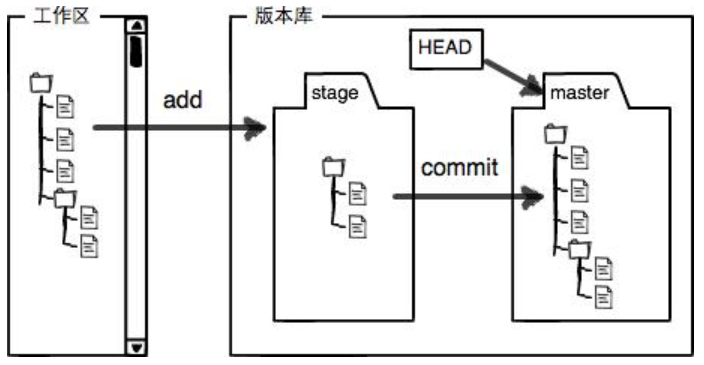
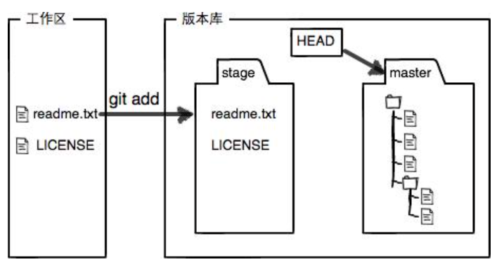
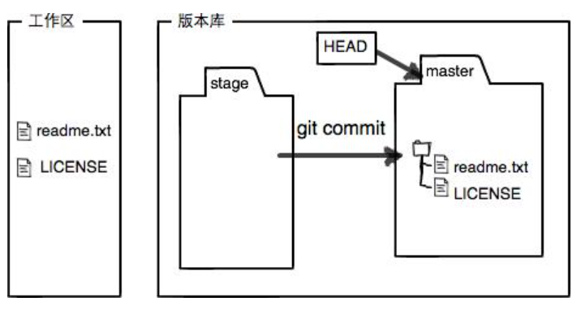

# Git
[第一章：git 配置及创建版本库](#第一章git-配置及创建版本库)  
[1.1 configure your git](#11-configure-your-git)  
[1.2 generate SSH Key](#12-generate-ssh-key)  
[1.3 connect local Repo with remote Repo](#13-connect-local-repo-with-remote-repo)  
[1.4: push file to remote Repo](#14-push-file-to-remote-repo)  
[1.5 删除远程库](#15-删除远程库即解除本地和远程的绑定关系)  
[1.6 从远程库克隆](#16-从远程库克隆)  
[1.7 创建与合并分支](#17-创建与合并分支)  
[1.8 多人协作](#18-多人协作)  
[第二章：版本管理](#第二章版本管理)   
[2.1 版本回退](#21-版本回退)  
[2.2 工作区和暂存区](#22-工作区和暂存区)  
[2.3 撤销修改](#23-撤销修改)  
[2.4 删除文件](#24-删除文件)
## 第一章：git 配置及创建版本库
## 1.1 configure your git
<!-- : change to your own name and email -->
    git config --global user.name 'daixiaozhuan'    
    git config --global user.email 'daixiaozhuan90@gmail.com'  
    git config --global color.ui true
## 1.2 generate SSH Key
<!-- press enter all the time -->
    ssh-keygen -t rsa -C "daixiaozhuan90@gmail.com" 
    cd ~/.ssh
    copy id_rsa.pub to github SSH Key
## 1.3 connect local Repo with remote Repo
    ##replace your own Repo path 
    git init  
    git remote add origin http://10.30.10.200:10080/daixiaozhuan/add_newfile.git   
    git remote -v ##查看远程库信息  
    git remote rm origin ##删除远程库
## 1.4: push file to remote Repo
<!-- git add filename -->

    git add .  
    git commit -m 'update'   
    git push -u origin master（第一次用-u可以把本地的master分支和远程的master 分支关联起来，后面再推送的时候就可以直接是git push origin master）


If there are errors, you need to pull readme to local Repo, push again after pull

    git pull --rebase origin master  
    git push -u origin master
  
## 1.5 删除远程库（即解除本地和远程的绑定关系）
    git remote -v ##查看远程库信息  
    git remote rm origin ##删除远程库，即解除和本地的绑定关系，并没有真正的物理删除。

## 1.6 从远程库克隆
    git clone http://10.30.10.200:10080/daixiaozhuan/gitskills.git （后面的地址是远程仓库）

## 小结
要关联一个远程库，使用命令 **git remote add origin git@server-name:path/repo-name.git**；

关联一个远程库时必须给远程库指定一个名字，**origin**是默认习惯命名；

关联后，使用命令**git push -u origin master**第一次推送master分支的所有内容，-u可以把本地和远程的master分支关联，后面再推送就不需要这个参数了；

此后，每次本地提交后，只要有必要，就可以使用命令**git push origin master**推送最新修改；

## 1.7 创建与合并分支
Git鼓励大量使用分支：

查看分支：**git branch**

创建分支：**git branch name**

切换分支：git checkout name或者**git switch name**,更推荐使用后者

创建+切换分支：**git checkout -b name**或者**git switch -c name**，更推荐使用后者

合并某分支到当前分支：**git merge name**

删除分支：**git branch -d name**

## 1.8 多人协作
多人协作的工作模式通常是这样：
1. 首先，可以试图用git push origin branch-name推送自己的修改；
2. 如果推送失败，则因为远程分支比你的本地更新，需要先用git pull试图合并；
3. 如果合并有冲突，则解决冲突，并在本地提交；
4. 没有冲突或者解决掉冲突后，再用git push origin branch-name 推送就能成功！
5. 在本地创建和远程分支对应的分支，使用git checkout -b branch-name origin/branch-name，本地和远程分支的名称最好一致；
6. 建立本地分支和远程分支的关联，使用git branch --set-upstream branch-name origin/branch-name；

## 如果我们希望体验Git飞一般的速度，可以使用国内的Git托管服务——Gitee（gitee.com）

## 第二章：版本管理
## 2.1 版本回退
## check the current status
### git status
```
On branch master
Your branch is up to date with 'origin/master'.

nothing to commit, working tree clean
```

## check the commit history
### git log 
```
commit 60901af9238b89b3bfbd8c3d24322e9354cd7349 (HEAD -> master, origin/master)
Author: daixiaozhuan <daixiaozhuan90@gmail.com>
Date:   Wed Mar 31 15:29:13 2021 +0800

    update

commit 0f5fb8d7566321a7f871a2e602c753ba5b378967
Author: daixiaozhuan <daixiaozhuan90@gmail.com>
Date:   Wed Mar 31 13:43:06 2021 +0800

    add new file
```

### git log --pretty=oneline (前面的一串数字是commit id)
```
60901af9238b89b3bfbd8c3d24322e9354cd7349 (HEAD -> master, origin/master) update
0f5fb8d7566321a7f871a2e602c753ba5b378967 add new file
6e4c138ace696faec415a0509592f8c2e46283c7 add new file to test.txt
```
## git go back to previous version 
### git reset --hard commit_id
```
版本号没必要写全，前几位就可以了，Git会自动去找。当然也不能只写前一两位，因为Git可能会找到多个版本号，就无法确定是哪一个了。
```
### git reset --hard HEAD^
```
上一个版本就是HEAD^，上上一个版本就是HEAD^^，往上100个版本写成HEAD~100
```

Git的版本回退速度非常快，因为Git在内部有个指向当前版本的HEAD指针，当你回退版本的时候，Git仅仅是把HEAD从指向update:


改为指向Add new file:

然后顺便把工作区的文件更新了。所以你让HEAD指向哪个版本号(commit id)，你就把当前版本定位在哪。

### 版本回退总结：
- HEAD指向的版本就是当前版本，因此，Git允许我们在版本的历史之间穿梭，使用命令git reset --hard commit_id。
- 穿梭前，用git log可以查看提交历史，以便确定要回退到哪个版本。
- 要重返未来，用git reflog查看命令历史，以便确定要回到未来的哪个版本，可以通过commit id来重返未来。

## 2.2 工作区和暂存区
### 工作区 (working directory)
就是你在自己电脑上创建的文件夹，比如新建一个文件夹mywork,那这个文件夹就是一个工作区
### 版本库 （Repository）
工作区有一个隐藏目录.git，这个不算工作区，而是Git的版本库。

Git的版本库里存了很多东西，其中最重要的就是称为stage（或者叫index）的暂存区，还有Git为我们自动创建的第一个分支master，以及指向master的一个指针叫HEAD。


前面讲了我们把文件往Git版本库里添加的时候，是分两步执行的：

第一步是用git add把文件添加进去，实际上就是把文件修改添加到暂存区；

第二步是用git commit提交更改，实际上就是把暂存区的所有内容提交到当前分支。

因为我们创建Git版本库时，Git自动为我们创建了唯一一个master分支，所以，现在，git commit就是往master分支上提交更改。

你可以简单理解为，需要提交的文件修改通通放到暂存区，然后，一次性提交暂存区的所有修改。
git add 可以添加多个文件到暂存区，然后git commit 将所有修改全部提交到当前分支。



### git diff HEAD -- readme.txt 
```
git diff 可以查看工作区和版本库中的文件的区别；
每次修改，如果不用git add到暂存区，那就不会加入到commit中。
```

## 2.3 撤销修改
场景1：当你改乱了工作区某个文件的内容，想直接丢弃工作区的修改时，用命令git checkout -- file。

场景2：当你不但改乱了工作区某个文件的内容，还添加到了暂存区时，想丢弃修改，分两步，第一步用命令git reset HEAD <file>，就回到了场景1，第二步按场景1操作 git checkout -- file。

场景3：已经提交了不合适的修改到版本库时，想要撤销本次提交，参考版本回退一节，不过前提是没有推送到远程库 git reset --hard commit id。

## 2.4 删除文件
场景1：文件test.txt已经提交到版本库，然后从工作区删除之后，想从版本库也删除，分两步，第一步用git rm test.txt,第二步是git commit,这样就把test.txt文件从版本库删除了。

场景2：另一种情况是删错了，因为版本库里还有呢，所以可以很轻松地把误删的文件恢复到最新版本：git checkout -- test.txt
```
命令git rm用于删除一个文件。如果一个文件已经被提交到版本库，那么你永远不用担心误删，但是要小心，你只能恢复文件到最新版本，你会丢失最近一次提交后你修改的内容。
```


